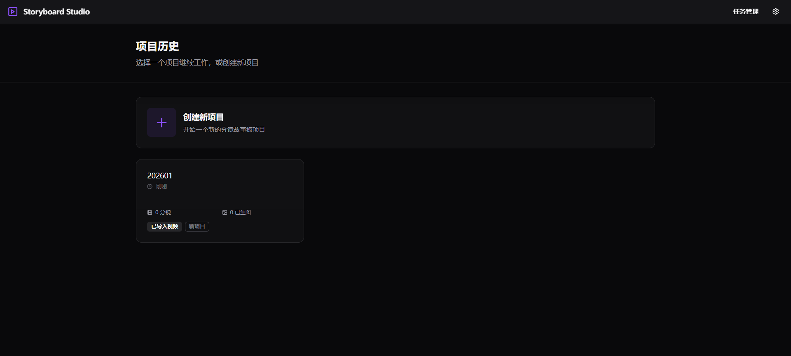
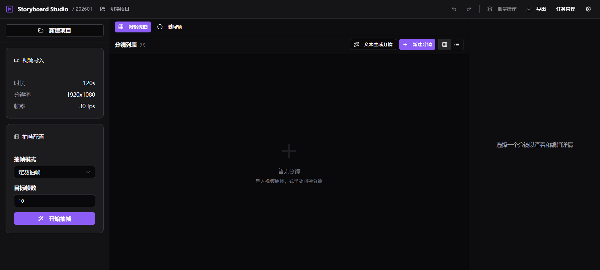
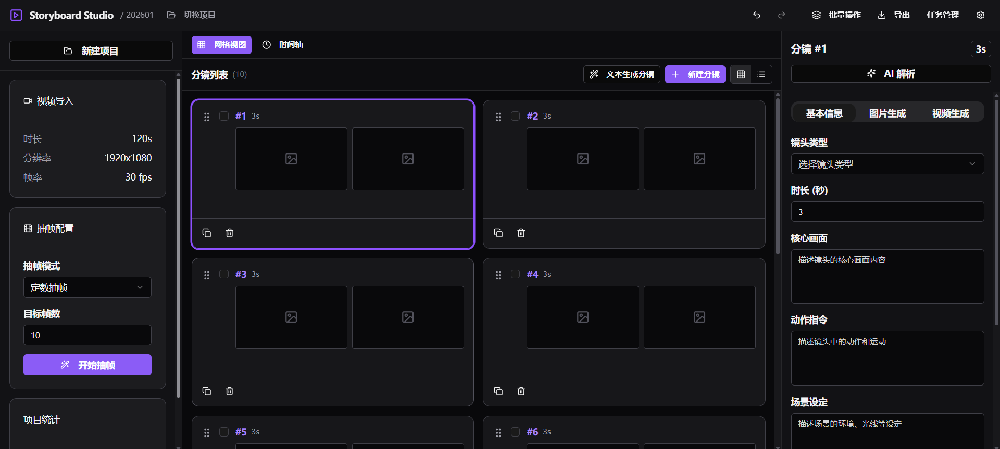
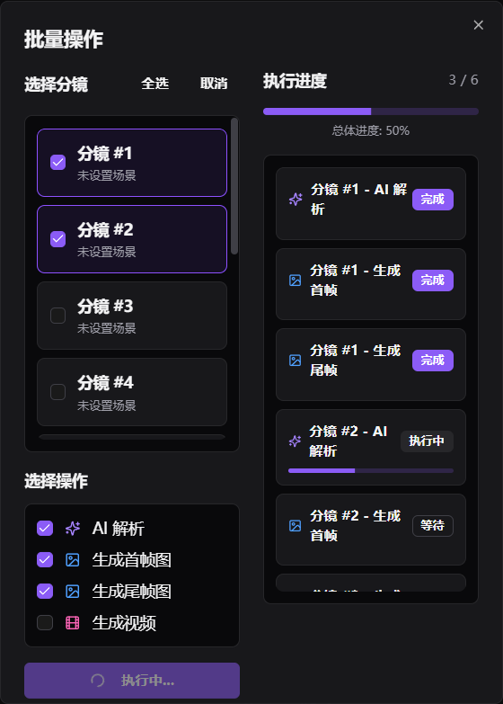
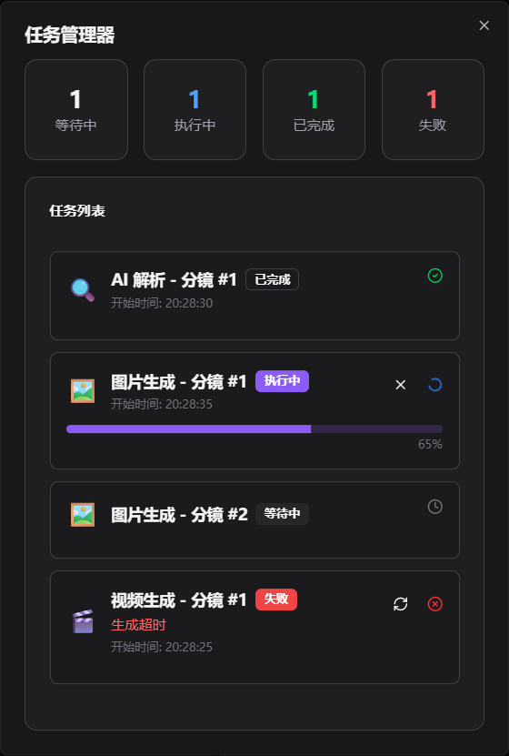
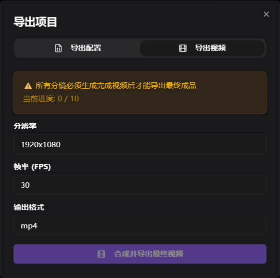
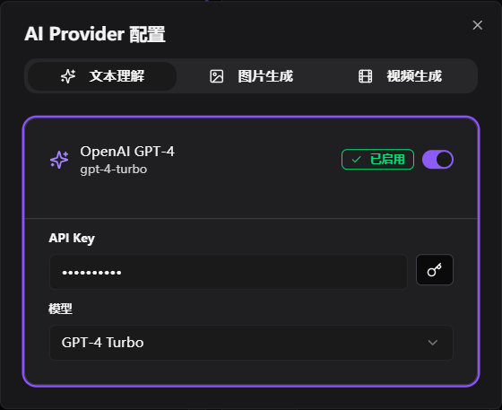

<h1 align="center">🎬 Storyboard Studio</h1>

<p align="center"><b>Local storyboard workbench: video import → frame extraction → AI analysis → image/video generation → batch jobs → final render</b></p>

<p align="center"><a href="README.md">中文</a> | English</p>

<p align="center">
  
  
  
  
  
</p>

> Import a video or text to quickly generate complete storyboards and assets. Supports multiple providers/models, with both local rendering/compositing and cloud calls.


## ✨ Highlights

- ✅ Project management: create/open projects, SQLite persistence, recent history.
- ✅ Video import & metadata parsing: auto-detect duration/resolution/fps (ffprobe).
- ✅ Four extraction modes: fixed count, dynamic interval, equal time, keyframe detection.
- ✅ Shot editing: full field editing, drag ordering, timeline view.
- ✅ AI shot parsing: head/tail features → structured descriptions (overwrite/append/skip).
- ✅ Text-to-storyboard: split natural language into multiple shots.
- ✅ Image/video generation: multi-run history for first/last/full, explicit binding by user.
- ✅ Config management: multi-provider/multi-model, separate text/image/video configs.
- ✅ Local capability: local image render + FFmpeg video, coexists with cloud models.
- ✅ Batch jobs & task management: parse/generate/compose without interference.
- ✅ Export: storyboard JSON and final video output.

## 🌐 Web Demo
UI only, no backend implementation
http://47.100.163.84/

## 🖼️ UI Preview

Home (create project)



Main page



Storyboard page



Batch jobs



Task management



Export



AI provider settings



## 🧭 Workflow

**Video import** → **Frame extraction/storyboard** → **AI analysis/text-to-storyboard** → **Image generation** → **Video generation** → **Final render**

Each stage can run independently, supporting manual edits and batch jobs.


## 🚀 Quick Start

1. Install .NET 8 SDK
2. Run in the project root:

```bash
dotnet restore
dotnet build
dotnet run
```

You can also open `Storyboard.sln` in Visual Studio 2022 and run directly.

## ⚙️ Configuration (Multi-model / Local)

Entry points:
- In-app "Provider Settings" page (recommended)
- Or edit `appsettings.json` directly

Key sections:
- `AIServices`: text understanding providers (Qwen / Zhipu / Wenxin / Volcengine / OpenAI / Azure OpenAI)
- `Image`: image generation providers (local renderer / OpenAI)
- `Video`: video generation providers (local FFmpeg)

Notes:
- Multiple providers/models can coexist; UI lets you choose defaults.
- Local render/compose and cloud models can be configured in parallel, switchable per task.


## 🗂️ Project Structure

```
分镜大师/
├─ App/                     # Avalonia UI
├─ Application/             # 应用层 / Application layer
├─ Domain/                  # 领域模型 / Domain models
├─ Infrastructure/          # 基础设施（持久化/AI/媒体服务） / Infrastructure (persistence/AI/media)
├─ Shared/                  # 跨层模型与 DTO / Shared models & DTOs
├─ Tools/ffmpeg/            # 内置 ffmpeg/ffprobe / Bundled ffmpeg/ffprobe
├─ appsettings.json
└─ Storyboard.sln
```

## 📦 Data & Output

- Database location: `Data/storyboard.db` (under the app base directory)
- Output paths: `output/projects/<ProjectId>/images`, `output/projects/<ProjectId>/videos`

## 🧰 FFmpeg Dependency

`Tools/ffmpeg` is bundled; video import, frame extraction, and local composition use it automatically.

## 🧪 Tech Stack

- Framework: .NET 8 + Avalonia
- Architecture: MVVM + layers (Domain / Application / Infrastructure / App)
- Data: SQLite + EF Core
- AI: Semantic Kernel + multi-provider adapters
- Media: FFmpeg / FFprobe

## 🗺️ Roadmap

- TTS voiceover
- Auto-editing optimization
- Automatic style transfer
- Social publishing
